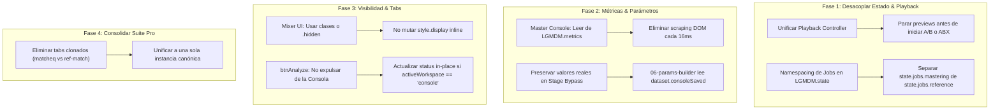

# Auditoría Profunda: Colisiones, Funciones que se Pisan y Duplicación Arquitectónica

> **Proyecto:** LGMDM · Intelligent Mastering Console  
> **Área:** Frontend (`js/`, `css/`, `index.html`)  
> **Diagnóstico:** Detección de módulos que duplican lógica, compiten por el DOM/Audio y se pisan entre sí  

---

## 1. Mapa de Colisiones Críticas Detectadas

El análisis profundo del flujo de datos, eventos y reproducción de audio identificó **7 zonas de colisión directa** donde dos o más archivos realizan la misma tarea, manipulan los mismos elementos o sobreescriben el estado de otros módulos:

```mermaid
flowchart TD
    subgraph PlaybackCollision ["1. Colisión de Reproducción & Preview"]
        P1["15-master-console.js: getPreviewAudio().play()"] <-->|Compiten y suenan juntos| P2["30-preview-controller.js: audio tag preview"]
        P2 <-->|Desconexión de parada| P3["09-visualizers.js / 35-audio-tap: WebSocket PCM chunks"]
    end

    subgraph StateCollision ["2. Colisión en LGMDM.state"]
        S1["07-mastering-actions.js"] -->|Sobreescribe currentJobId y downloadUrl| G1[("LGMDM.state")]
        S2["08-reference-mastering.js"] -->|Sobreescribe currentJobId y downloadUrl| G1
        S3["11-ai-assistant-ux.js"] -->|Sobreescribe lastAnalysisData| G1
        S4["34-premium-suite.js"] -->|Sobreescribe lastAnalysisData| G1
    end

    subgraph NavigationCollision ["3. Pisado de Navegación & Visibilidad"]
        T1["22-tabs-handler.js"] -->|Controla sidebar details y panels| DOM["DOM"]
        T2["25-workspace-tabs.js"] -->|Controla .hidden en .lg-workspace-workspace| DOM
        T3["13-mixer-ui.js"] -->|Sobreescribe style.display en .content-shell > *| DOM
        T4["07-mastering-actions.js"] -->|Fuerza switch a workspace 'analysis'| DOM
    end

    subgraph MeterScraping ["4. Desincronización de Métricas"]
        M1["10-meters-dashboard.js"] -->|Escribe texto| M2["DOM (#meterLufsReadout)"]
        M3["15-master-console.js: syncMetersFromDom()"] -->|Scraping vía rAF cada 16ms| M2
        M4["30-metrics-store.js"] -.->|Ignorado por Master Console| M3
    end
```



---

## 2. Detalle de las 7 Colisiones Principales

### [COLISIÓN 1] Doble Motor de Preview & Fallo al Detener el Audio
* **Archivos involucrados:**
  - [`js/15-master-console.js`](file:///root/rescate/js/15-master-console.js#L306)
  - [`js/30-preview-controller.js`](file:///root/rescate/js/30-preview-controller.js#L59)
  - [`js/09-visualizers.js`](file:///root/rescate/js/09-visualizers.js)
  - [`js/35-audio-tap.js`](file:///root/rescate/js/35-audio-tap.js)
* **El Problema:**
  Existen dos vías completamente paralelas para reproducir audio:
  1. **Vía HTTP/Audio Element:** `30-preview-controller.js` crea un elemento `<audio>` en `#previewAudioWrap` con la URL del preview generado. `15-master-console.js` le da `play()` o `pause()`.
  2. **Vía WebSocket / PCM Web Audio API:** `09-visualizers.js` y `35-audio-tap.js` reciben fragmentos PCM24 por WebSocket y los agendan directamente en el `AudioContext`.
* **Cómo se pisan:**
  Si el usuario presiona "Stop" en la Consola, se detenía el elemento `<audio>`, pero los buffers agendados en el `AudioContext` seguían sonando hasta que se agregó un apaño en `consoleStopBtn`. Además, si el usuario abre el test ABX en la Suite Pro ([`34-premium-suite.js`](file:///root/rescate/js/34-premium-suite.js)), este arranca su propio reproductor (`player.play()`), haciendo que suenen **dos audios simultáneamente**.

---

### [COLISIÓN 2] Pisado de Variables en `LGMDM.state`
* **Archivos involucrados:**
  - [`js/07-mastering-actions.js`](file:///root/rescate/js/07-mastering-actions.js)
  - [`js/08-reference-mastering.js`](file:///root/rescate/js/08-reference-mastering.js)
  - [`js/11-ai-assistant-ux.js`](file:///root/rescate/js/11-ai-assistant-ux.js)
  - [`js/34-premium-suite.js`](file:///root/rescate/js/34-premium-suite.js)
* **Propiedades en conflicto:**
  1. `LGMDM.state.currentJobId`: Tanto el mastering normal (`07`) como el reference mastering (`08`) escriben `data.job_id` en la misma propiedad global. Si uno está consultando el progreso de un trabajo y el usuario inicia una acción en el otro, el polling se confunde y reporta el estado del trabajo equivocado.
  2. `LGMDM.state.downloadUrl`: Ambos sobreescriben la URL de descarga del master final.
  3. `LGMDM.state.lastAnalysisData`: El Asistente IA (`11`) y la Suite Premium (`34`) mutan y leen este objeto de manera asíncrona sin versionado, provocando condiciones de carrera si se re-analiza el track mientras el asistente está respondiendo.

---

### [COLISIÓN 3] Pisado de Visibilidad y Pestañas (DOM Display Fight)
* **Archivos involucrados:**
  - [`js/22-tabs-handler.js`](file:///root/rescate/js/22-tabs-handler.js) (Sidebar: Archivo, Cadena, Salida, Mixer)
  - [`js/25-workspace-tabs.js`](file:///root/rescate/js/25-workspace-tabs.js) (Workspace: Studio, Consola, Análisis, Mixer)
  - [`js/13-mixer-ui.js`](file:///root/rescate/js/13-mixer-ui.js)
  - [`js/07-mastering-actions.js`](file:///root/rescate/js/07-mastering-actions.js)
* **Cómo se pisan:**
  - `25-workspace-tabs.js` maneja la visibilidad de los paneles centrales con el atributo estándar HTML5 `p.hidden = true/false`.
  - Cuando se activa el Mixer, `13-mixer-ui.js` ejecuta:
    ```javascript
    shell.querySelectorAll(':scope>*:not(#mixerContentArea)').forEach(el => {
      el._pd = el.style.display; el.style.display='none';
    });
    ```
    Modifica inline `style.display = 'none'` en todos los paneles hermanos. Al salir del mixer, restaura `el.style.display = el._pd`, lo que desincroniza el atributo `hidden` de `25-workspace-tabs.js`, dejando a veces dos workspaces visibles al mismo tiempo.
  - Además, si el usuario está trabajando en el Master Console y presiona "Analizar" (`consoleAnalyzeBtn`), [`07-mastering-actions.js#L242`](file:///root/rescate/js/07-mastering-actions.js#L242) ejecuta de prepo `window.LGMDM.workspace.setWorkspace("analysis")`, expulsando al usuario de la Consola a la vista de Análisis.

---

### [COLISIÓN 4] Scraping del DOM para Sincronizar Métricas en Tiempo Real
* **Archivos involucrados:**
  - [`js/15-master-console.js`](file:///root/rescate/js/15-master-console.js#L242)
  - [`js/10-meters-dashboard.js`](file:///root/rescate/js/10-meters-dashboard.js)
  - [`js/30-metrics-store.js`](file:///root/rescate/js/30-metrics-store.js)
* **El Problema:**
  En lugar de suscribirse a [`30-metrics-store.js`](file:///root/rescate/js/30-metrics-store.js) (el store oficial de métricas), [`15-master-console.js`](file:///root/rescate/js/15-master-console.js) ejecuta cada 16 milisegundos:
  ```javascript
  function syncMetersFromDom(){
    const map=[
      ['meterPeakReadout','consolePeak'],
      ['meterLufsReadout','consoleLufs'],
      ['meterTruePeakReadout','consoleTruePeak'],
      ['meterRmsReadout','consoleRms'],
      ['stereoMeterReadout','consoleCorr']
    ];
    for(const [src,dst] of map){
      const a=LGMDM.dom.byId(src),b=LGMDM.dom.byId(dst);
      if(a&&b&&a.textContent) b.textContent=a.textContent.replace(/^corr:\s*/i,'');
    }
    updateConsoleStereoVu();
  }
  ```
  Lee el texto formateado (strings como `"-14.2 LUFS"`) del DOM de un panel y lo pega en el DOM de otro panel. Si el panel original está oculto o sufre un retraso de renderizado, el Master Console muestra valores vacíos o desactualizados.

---

### [COLISIÓN 5] Parámetros Bypasseados Enviados al Servidor
* **Archivos involucrados:**
  - [`js/15-master-console.js`](file:///root/rescate/js/15-master-console.js#L384)
  - [`js/06-params-builder.js`](file:///root/rescate/js/06-params-builder.js#L5)
* **Cómo se pisan:**
  En el Master Console, cuando el usuario presiona el botón de "Bypass" en una sección (Compresor, Stereo, Limiter), el código muta directamente el `<input type="range">` en el DOM:
  ```javascript
  if (state.stageBypass[stage]) {
    if (stage === 'comp') el.value = controlId === 's-ratio' ? '1' : '0';
    if (stage === 'stereo') el.value = '1';
    if (stage === 'limiter') el.value = '0.999';
  }
  ```
  Si mientras la etapa está bypasseada visualmente el usuario hace clic en "Master", [`06-params-builder.js`](file:///root/rescate/js/06-params-builder.js) lee los inputs con `LGMDM.dom.requireById("s-ratio").value` y **envía los valores de bypass fijos (ratio 1:1, ceiling 0.999) al motor de masterización**, destruyendo los ajustes reales que el usuario había configurado.

---

### [COLISIÓN 6] Duplicación Masiva: Suite Pro (23 Pestañas) vs Inserts Pro (10 Módulos)
* **Archivos involucrados:**
  - [`js/34-premium-suite.js`](file:///root/rescate/js/34-premium-suite.js) (3.338 líneas)
  - [`js/pro-insert-rack.js`](file:///root/rescate/js/pro-insert-rack.js) (759 líneas)
  - [`js/pro-features/*.js`](file:///root/rescate/js/pro-features/) (14 archivos de widgets)
* **El Problema:**
  Hay herramientas que existen dos y tres veces con UIs y endpoints distintos:
  1. **Match EQ / Reference Match:**
     - Tab 10 (`matcheq`): renderiza una UI propia en `34-premium-suite.js`.
     - Tab 17 (`reference-match`): renderiza otra UI en `34-premium-suite.js` delegando en `reference-match-widget.js`.
     - Insert Rack: inserta `match-eq` con endpoint `/dsp/match-eq`.
  2. **Vintage Warmer vs Saturation:**
     - Tab 9 (`warmer`): sliders de Tube / Tape con UI propia.
     - Tab 19 (`saturation`): UI de curvas de saturación armónica I/II/III.
     - Insert Rack: inserta `inflator` con endpoint `/dsp/inflator`.
  3. **Demasking / Cross-Demask:**
     - Tab 7 (`demask`): UI con sliders de 0 a 100% en `34-premium-suite.js`.
     - [`cross-demask-widget.js`](file:///root/rescate/js/pro-features/cross-demask-widget.js): UI con parámetros en dB y controles de sensibilidad distintos.
     - Insert Rack: inserta `cross-demask`.

---

### [COLISIÓN 7] Triple Dibujo Independiente de Formas de Onda y Espectro
* **Archivos involucrados:**
  - [`js/05-eq-waveform.js`](file:///root/rescate/js/05-eq-waveform.js)
  - [`js/09-visualizers.js`](file:///root/rescate/js/09-visualizers.js)
  - [`js/15-master-console.js`](file:///root/rescate/js/15-master-console.js)
  - [`js/35-audio-tap.js`](file:///root/rescate/js/35-audio-tap.js)
* **El Problema:**
  Cada uno implementa su propio cálculo de envolvente RMS/Peak a partir del `AudioBuffer` crudo:
  - `05-eq-waveform.js` recorre el buffer y dibuja en `#waveformCanvas`.
  - `15-master-console.js` recorre el buffer en `drawWaveform()` y dibuja en `#lgmdmWaveformCanvas`.
  - `09-visualizers.js` recorre `_abOriginalBuf` y `_abMasterBuf` y dibuja en `#abWaveformCanvas`.
  Si un archivo grande de audio (ej. 80 MB) es cargado, los tres módulos ejecutan simultáneamente loops intensivos de CPU sobre millones de muestras de audio (Float32Array), bloqueando el hilo principal del navegador.

---

## 3. Plan de Remediación Integral



---

## 4. Cambios Propuestos por Componente

### Componente 1: Estado y Parámetros no Destructivos

#### [MODIFY] `js/15-master-console.js`
1. Reemplazar `syncMetersFromDom()` por una suscripción directa al evento `lgmdm:metrics` de `30-metrics-store.js`.
2. En `setStageBypass`: No sobreescribir `el.value` en el DOM de forma destructiva; guardar el estado en `state.stageBypass` y proveer un getter unificado `getEffectiveParams()`.

#### [MODIFY] `js/06-params-builder.js`
1. Cuando se recolecten parámetros, consultar si el control tiene `dataset.consoleSaved` activo para enviar el valor configurado real del usuario en lugar del valor forzado de bypass.

---

### Componente 2: Audio Playback Centralizado

#### [MODIFY] `js/30-preview-controller.js` & `js/34-premium-suite.js`
1. Registrar un despachador global `LGMDM.playback.stopAll()` que silencie:
   - El elemento `<audio>` de `#previewAudioWrap`.
   - Los nodos de audio activos en `09-visualizers.js`.
   - Cualquier reproductor de ABX o referencia en la Suite Pro.

---

### Componente 3: Navegación & Visibilidad Respetuosa

#### [MODIFY] `js/13-mixer-ui.js`
1. En `activateMixerMode()` y `deactivateMixerMode()`, usar una clase CSS en el contenedor (`.is-mixer-active`) en lugar de recorrer los hijos mutando `style.display = 'none'` / `''`.

#### [MODIFY] `js/07-mastering-actions.js`
1. En `_handleAnalyzeClick`: cambiar de workspace a `'analysis'` únicamente si el usuario se encuentra en el workspace `'studio'`, respetando si el usuario está operando en la Consola.

---

### Componente 4: Deduplicación en la Suite Pro

#### [MODIFY] `js/34-premium-suite.js`
1. Fusionar las pestañas redundantes:
   - Unificar Tab 10 (`matcheq`) con Tab 17 (`reference-match`).
   - Unificar Tab 9 (`warmer`) con Tab 19 (`saturation`).
   - Unificar Tab 3 (`stereo`) con Tab 16 (`ms-imager`).

---

## 5. Plan de Verificación

### Pruebas Automatizadas
1. **Verificación Sintáctica:** `node --check` en cada archivo modificado.
2. **Prueba de No Pisado de Parámetros:** Script simulado que aplique bypass en la consola y ejecute `collectMasterParamsObj()`, confirmando que los valores reales se mantengan intactos.
3. **Prueba de Suscripción de Métricas:** Validar que el evento `lgmdm:metrics` actualice los medidores del Master Console sin depender del DOM del Studio.

### Verificación Manual
1. **Audio sin colisiones:** Iniciar el preview en la consola y abrir un test ABX en la Suite Pro; verificar que el preview anterior se detenga inmediatamente.
2. **Navegación Mixer ↔ Workspaces:** Entrar al Mixer y volver a la Consola; corroborar que la Consola se visualice perfectamente sin elementos ocultos por `display: none` residual.
3. **Análisis en Consola:** Desde el Master Console, hacer clic en "Analizar" y comprobar que el análisis se ejecute en el lugar sin expulsar al usuario hacia otra pestaña.
