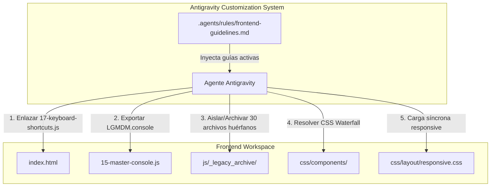

# Auditoría Técnica Completa de Frontend & Plan de Remediación

> **Proyecto:** LGMDM · Intelligent Mastering Console  
> **Área:** Frontend (`index.html`, `login.html`, `css/`, `js/`)  
> **Fecha de Análisis:** Septiembre 2026  
> **Estado:** Listo para revisión y aprobación  

---

## 1. Resumen Ejecutivo & Scorecard

Se ha realizado una auditoría estática, arquitectónica, de seguridad, rendimiento y accesibilidad al 100% del código fuente del frontend en `/root/rescate`.

El frontend es una Single Page Application (SPA) para masterización de audio profesional en tiempo real basada en Web Audio API, Canvas 2D, WebSockets y una API REST externa.

### Matriz de Evaluación

| Dimensión | Calificación | Estado | Hallazgo Principal |
| :--- | :---: | :---: | :--- |
| **Arquitectura de Scripts** | **C+** | ⚠️ Advertencia | Arquitectura dual desfasada: 60 scripts enlazados con `defer` en el espacio global `window.LGMDM` conviviendo con 30 archivos huérfanos/ESM (~204 KB) no cargados. |
| **Integridad de Módulos & APIs** | **B** | ⚠️ Advertencia | Falta el enlace a `17-keyboard-shortcuts.js` en `index.html`. Falta exportar `LGMDM.console.setAB` en `15-master-console.js`, rompiendo la sincronización A/B con la Suite Premium. |
| **Rendimiento de Red & Carga** | **B-** | ⚠️ Advertencia | 60 peticiones HTTP individuales de scripts sin empaquetar (~896 KB). `css/components/_index.css` usa 13 `@import url()`, generando cascada (waterfall) de red. `responsive.css` cargado diferido (`media="print"`), provocando FOUC en móviles. |
| **Seguridad (XSS, Auth, CSP)** | **B+** | 🟢 Bueno | Uso de `escapeHtml` consistente en plantillas dinámicas, validación estricta de origen en `00-api.js`, tokens en `sessionStorage`. **Vulnerabilidad leve:** ausencia de cabecera/meta Content Security Policy (CSP). |
| **Integridad DOM & HTML** | **A-** | 🟢 Excelente | 568 IDs únicos analizados con **0 duplicados**. 193 bloques de etiquetas `<label>` bien vinculados. Elementos dinámicos en Canvas y Modales gestionados correctamente. |
| **Web Audio API & Canvas** | **A-** | 🟢 Excelente | Un único `AudioContext` interactivo centralizado (`00-audio-engine.js`). Mixin `36-base-canvas-widget.js` controla rAF a 60fps con `ResizeObserver` y cleanup adecuado. |
| **Accesibilidad (a11y)** | **B** | 🟡 Aceptable | Roles ARIA en modales y pestañas, anuncios `aria-live`. Los atajos de teclado profesionales y modal de ayuda están implementados en `17-keyboard-shortcuts.js` pero no se encuentran inyectados en la página. |

---

## 2. Hallazgos Críticos y Detallados

### [HALLAZGO 1] 30 Archivos JavaScript Huérfanos / Desfasados (4.811 líneas / 203.8 KB)
* **Severidad:** Media (Deuda técnica y confusión de mantenimiento)
* **Ubicación:** Directorio `js/`
* **Detalle:** De los 90 archivos `.js` existentes, **solo 60 están cargados en `index.html`**:
  * Existe una implementación en módulos ES (`main.js`, `auth.js`, `api.js`, `state.js`, etc.) que quedó inconclusa o abandonada en favor de la arquitectura de scripts secuenciales numerados (`00-api.js`, `00-auth.js`, `01-state.js`, etc.).
  * Archivos huérfanos detectados:
    `js/00-error-handler.js`, `js/00-memory-cleanup.js`, `js/00-observability.js`, `js/33-studio-controller.js`, `js/ai-assistant-ux.js`, `js/analysis-view.js`, `js/api.js`, `js/auth.js`, `js/confirm-panel.js`, `js/console-resize.js`, `js/file.js`, `js/flex-layout.js`, `js/header-resize.js`, `js/library-picker.js`, `js/main.js`, `js/make-resizable.js`, `js/master-console.js`, `js/mastering.js`, `js/meters-dashboard.js`, `js/params.js`, `js/preview-controller.js`, `js/reference-mastering.js`, `js/spectrum-controller.js`, `js/state.js`, `js/storage.js`, `js/studio-controller.js`, `js/system-status.js`, `js/visualizers.js`, `js/workspace-tabs.js`.
* **Impacto:** Posibles errores al editar accidentalmente un archivo no conectado al runtime de producción.

---

### [HALLAZGO 2] Atajos de Teclado Profesionales No Cargados en el DOM
* **Severidad:** Alta (Pérdida de funcionalidad clave ya desarrollada)
* **Ubicación:** [17-keyboard-shortcuts.js](file:///root/rescate/js/17-keyboard-shortcuts.js) y [index.html](file:///root/rescate/index.html)
* **Detalle:** `17-keyboard-shortcuts.js` contiene 356 líneas implementando atajos de teclado profesionales (Espacio para Play/Pause, Ctrl+B para A/B, Ctrl+Z / Ctrl+Shift+Z para Undo/Redo, flechas para variar sliders enfocados, `?` para el modal de ayuda con atajos). **Sin embargo, no está incluido en las etiquetas `<script>` de `index.html`**.
* **Impacto:** Los usuarios no pueden utilizar los atajos ni acceder al panel de ayuda interactivo.

---

### [HALLAZGO 3] `LGMDM.console` no exportado: Desincronización A/B en Suite Premium
* **Severidad:** Media-Alta (Bug funcional silencioso)
* **Ubicación:** [34-premium-suite.js#L791](file:///root/rescate/js/34-premium-suite.js#L791) y [15-master-console.js#L89](file:///root/rescate/js/15-master-console.js#L89)
* **Detalle:** En `34-premium-suite.js`:
  ```javascript
  if (typeof window.LGMDM?.console?.setAB === 'function') {
    try { window.LGMDM.console.setAB(targetMode); } catch (_) {}
  }
  ```
  En `15-master-console.js`, la función `setAB(mode)` existe localmente en el scope de la IIFE, pero **nunca se publica en `LGMDM.console`**.
* **Impacto:** Al conmutar el modo A/B en la Suite Pro, los indicadores visuales y botones del Master Console no se actualizan.

---

### [HALLAZGO 4] Cascada de Peticiones CSS (`@import` en `_index.css`)
* **Severidad:** Media (Rendimiento de renderizado)
* **Ubicación:** [css/components/_index.css](file:///root/rescate/css/components/_index.css)
* **Detalle:** `_index.css` ejecuta 13 directivas `@import url(...)` anidadas:
  ```css
  @import url('base.css');
  @import url('utilities.css');
  @import url('buttons.css');
  ... (10 imports más)
  ```
  Los `@import` dentro de archivos CSS no se descargan en paralelo con el documento principal; bloquean el analizador CSS de forma secuencial creando múltiples Round Trips (RTT).
* **Impacto:** Retraso en el First Contentful Paint (FCP) y Largest Contentful Paint (LCP).

---

### [HALLAZGO 5] Defer Peligroso de `responsive.css`
* **Severidad:** Media (Experiencia móvil y FOUC)
* **Ubicación:** [index.html#L33](file:///root/rescate/index.html#L33)
* **Detalle:**
  ```html
  <link href="css/layout/responsive.css" rel="stylesheet" media="print" onload="this.media='all'"/>
  ```
  `responsive.css` define las reglas `@media (max-width: 900px)` y `1200px` para reorganizar el layout en grillas de 1 columna. Al cargarse con `media="print"` y diferirse al evento `onload`, en pantallas móviles o tablets la interfaz se dibuja en formato de escritorio roto durante varias fracciones de segundo hasta que el evento JS conmuta el medio a `'all'`.

---

### [HALLAZGO 6] Manejo de Sesión Caída y Fallo de Conexión en `login.html`
* **Severidad:** Media (Resiliencia de UX)
* **Ubicación:** [login.html#L340](file:///root/rescate/login.html#L340) y [login.html#L426](file:///root/rescate/login.html#L426)
* **Detalle:**
  1. En el script inicial de `login.html`, `fetch(`${API_BASE}/auth/me`)` no cuenta con cláusula `.catch()`. Si el backend está apagado o falla la red, arroja un `Unhandled Promise Rejection` en la consola.
  2. En el submit del formulario de login, si la red falla, el error captura `"Failed to fetch"` (en inglés del navegador) y no explica al usuario si el servidor no está respondiendo.
  3. En `00-auth.js` de `index.html`, si `/auth/me` falla por timeout de red, redirige agresivamente a `login.html` borrando la sesión previa incluso ante una desconexión transitoria.

---

### [HALLAZGO 7] Ausencia de Política de Seguridad de Contenido (CSP)
* **Severidad:** Baja-Media (Hardening de Seguridad)
* **Ubicación:** [index.html](file:///root/rescate/index.html) y [login.html](file:///root/rescate/login.html)
* **Detalle:** No existe etiqueta `<meta http-equiv="Content-Security-Policy">`. Si bien la aplicación sanitiza correctamente las entradas dinámicas, un CSP explícito previene la inyección de scripts externos y define los orígenes permitidos para WebSockets (`wss:`), Web Audio (`blob:`, `data:`) y la API (`https://masteringstudio-api.duckdns.org` y `http://127.0.0.1:8000`).

---

## 3. Integración con Antigravity Customizations (`/agy-customizations`)

Para asegurar la calidad continua del código y evitar la acumulación futura de archivos huérfanos o malas prácticas, se propone integrar reglas de Antigravity en el repositorio:

1. **Regla de Workspace (`.agents/rules/frontend-guidelines.md`):**
   * Configuración de regla `always_on` para el frontend.
   * Regla de exportación obligatoria en `window.LGMDM`.
   * Prohibición de `@import` en hojas de estilo finales.
   * Obligatoriedad de registrar nuevos scripts en `index.html` siguiendo la secuencia de carga.
   * Regla de sanitización mediante `LGMDM.ui.escapeHtml()`.



---

## 4. User Review Required

> [!IMPORTANT]
> **Archivado de los 30 archivos huérfanos en `js/_legacy_archive/`:**
> Se propone mover los 30 archivos redundantes/inconclusos (`main.js`, `state.js`, `auth.js`, etc.) a un subdirectorio `js/_legacy_archive/` en lugar de eliminarlos directamente. De esta forma, el directorio `js/` queda 100% limpio y coincidente con los scripts en uso, preservando el código original por si se desea consultar.

> [!WARNING]
> **Cambio en la carga de `responsive.css`:**
> Se removerá el `media="print" onload="this.media='all'"` de `responsive.css` para que sea una hoja de estilo síncrona regular en `<head>`. Esto elimina el parpadeo de diseño en smartphones y tablets.

---

## 5. Open Questions

1. **Empaquetado vs Scripts Tradicionales:**  
   ¿Prefieres mantener la arquitectura actual de scripts independientes cargados secuencialmente vía `<script defer>`, o te gustaría que a futuro configuremos un bundler ligero (como Vite o esbuild) para consolidar los 60 scripts en 1 o 2 bundles optimizados?
2. **Archivado vs Eliminación:**  
   ¿Deseas mover los 30 archivos huérfanos a `js/_legacy_archive/` o prefieres conservarlos en la raíz de `js/`?

---

## 6. Plan de Modificaciones Propuesto

### Componente 1: Correcciones Críticas de Lógica & Vinculación

#### [MODIFY] `index.html`
* Enlazar `js/17-keyboard-shortcuts.js` en el orden correcto de dependencias (justo antes o después de `js/18-undo-redo.js`).
* Corregir la carga diferida de `css/layout/responsive.css` eliminando el hack `media="print"`.
* Agregar directiva básica de Content Security Policy (CSP).

```html
<!-- Enlace de hoja de estilo responsive sin FOUC -->
<link href="css/layout/responsive.css" rel="stylesheet"/>

<!-- Carga del módulo de atajos de teclado -->
<script defer src="js/17-keyboard-shortcuts.js"></script>
<script defer src="js/18-undo-redo.js"></script>
```

#### [MODIFY] `js/15-master-console.js`
* Exportar la API pública `LGMDM.console = { setAB, syncTrackInfo, setStatus }` al final del módulo para sincronizarse con `34-premium-suite.js`.

```javascript
// Exportar interfaz para sincronización con widgets externos
LG.console = Object.assign(LG.console || {}, {
  setAB,
  setStatus,
  syncTrackInfo
});
```

---

### Componente 2: Limpieza y Orden Arquitectónico

#### [MOVE] Archivos huérfanos a `js/_legacy_archive/`
* Crear directorio `js/_legacy_archive/`.
* Mover los 30 archivos no referenciados para que `js/` contenga exactamente los módulos operativos.

---

### Componente 3: Optimización CSS

#### [MODIFY] `css/components/_index.css` & `index.html`
* Evaluar el inlineo o linkeo explícito de los componentes en `index.html` para evitar el waterfall de 13 peticiones secuenciales de `@import`.

---

### Componente 4: Reglas Antigravity para el Proyecto

#### [NEW] `.agents/rules/frontend-guidelines.md`
* Crear directivas de desarrollo permanente para cualquier agente o desarrollador que trabaje en `/root/rescate`.

---

## 7. Plan de Verificación

### Pruebas Automatizadas
1. **Verificación de sintaxis completa:**
   `node --check` en cada archivo `.js` de `js/` y `js/pro-features/`.
2. **Auditoría de integridad de enlaces:**
   Script de verificación que compruebe que el 100% de los `<script src="...">` y `<link href="...">` en `index.html` existan físicamente y respondan código 200.
3. **Comprobación de sincronización A/B:**
   Simulación mediante Node.js comprobando que `typeof window.LGMDM.console.setAB === 'function'`.

### Verificación Manual
1. **Atajos de teclado:** Abrir la consola en el navegador, presionar `?` y verificar que se despliega el modal interactivo de atajos. Probar Espacio para Play/Pause y `Ctrl+B` para alternar A/B.
2. **Suite Premium ↔ Master Console:** Abrir la Suite Pro, cambiar el switch A/B y corroborar que los LEDs y labels del Master Console cambian en tiempo real.
3. **Vista responsiva:** Redimensionar la ventana a < 900px y recargar; confirmar que la interfaz no presenta FOUC ni se rompe.
